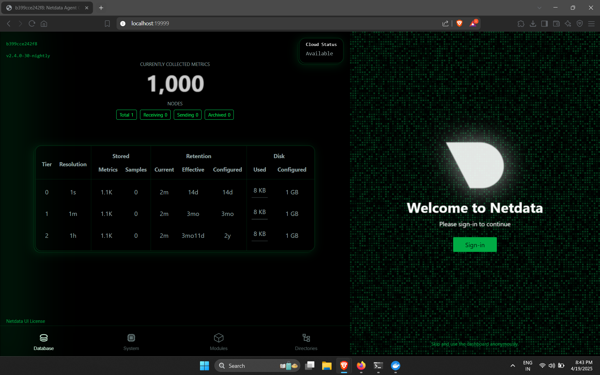

# Task 7: Monitor System Resources Using Netdata

## 📊 Objective

Install and explore **Netdata** to monitor system and application performance in real-time.

## 🔧 Tools Used

- Docker
- Netdata (running via container)
- Host OS: Ubuntu (or Windows WSL/Linux/Mac)

## 🚀 Installation Command

```bash
docker run -d --name=netdata -p 19999:19999 --cap-add SYS_PTRACE --security-opt apparmor=unconfined netdata/netdata
```

Access the dashboard at: [http://localhost:19999](http://localhost:19999)

## 📸 Screenshot



## 🔍 What I Explored

- CPU usage, RAM, and disk performance
- Docker container-level metrics
- Netdata dashboard charts & alerts
- System logs in `/var/log/netdata/`

## 📁 Logs

Sample log collected:
```bash
docker exec -it netdata bash
cat /var/log/netdata/error.log
```

Saved sample in `logs/netdata-log-sample.txt`

## 🧠 Key Learnings

- Netdata provides real-time visualization without setup hassle.
- Useful for monitoring small servers or testing environments.
- Alerts and charts are interactive and highly detailed.

---


